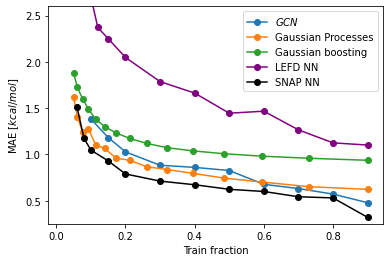

***Bachelor Thesis - March 2021 - Karlsruhe Institute of Technology***

# Rotationally invariant neural networks for homogenous catalysis

*Leon Jungemeyer*

While there are many standart chemical feature extractor, none of the state-of-the-art feature extractors today allow for a conversion back from feature space to chemical space. This makes interpretations of predictions impossible. This thesis aims at extracting features from catalyst molecules that allow for a conversion back from feature space to chemical space, allowing for an in depth analysis on what parts of the chemical structure is responsible for the prediction.

## Abstract

Metal Catalysts are crucial for a variety of applications, from water splitting to CO2 reduction. Catalysts derived from Vaska’s complex can be constructed by combining different ligands around an iridium atom. Depending on the structure of the resulting complex, the activation barrier will vary.

Due to the large space of possible ligand combinations and the complexity of quantum chemistry methods, experimental or virtual exploration of activation energies is impractical. Machine learning can bridge the gap and allow for fast prediction of a catalysts activation barrier. The methods proposed here are capable of performing high accuracy predictions of the activation barrier based on the 3D shape of the molecule.

Two different ways of encoding a catalysts into a format understandable to a neural network are explored. The first is using elliptic fourier descriptors to generate fully rotationally invariant features. The second is using a combination of spherical harmonics and radial basis functions to generate a representation of the molecule. Both feature generators proposed allow for a semi bi-directional mapping between feature space and chemical space.

A neural network is then trained to predict the activation barrier from these features. The best neural network achieves an accuracy of 0.53kcal/mol and r^2 = 0.96 on a train fraction of 80%.

In a last step, the neural network is used to analyze which parts of the catalyst are important to the prediction of the activation barrier. With this information an intuition on how the chemical structure has to be changed in order to lower the activation barrier can be learned.

## Overview

The first step for any machine learning task is generating features. The features generated here are using a combination of spherical harmonis and radial basis functions to create a basis that can describe the density space surrounding a central atom.

The features are genrated for each species in the dataset. Here the features for phosphorus are visulaized:

The features are then used in a neural network. The network predicts the activation barrier from the generated features. The accuracies reached are the highes accuracies on this dataset to date.

In a last step, the netowrk is analysed. This allows to learn about the influence of certain parts of the molecule on the prediction. In the following graph, the influence of nitrogen on the prediction is visualised. The negative density indicated removing nitrogen in this are will decrease the prediction of the model. In many cases, this intuition correlates with the ground truth.

## Documentation

The full Bachelor's thesis can be found under releases. 
